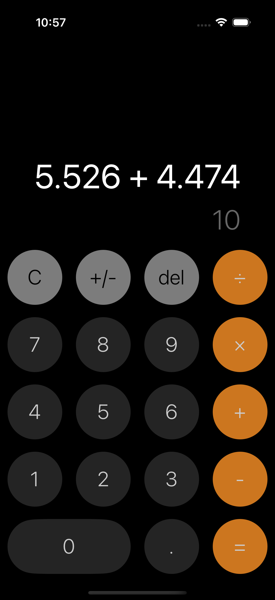
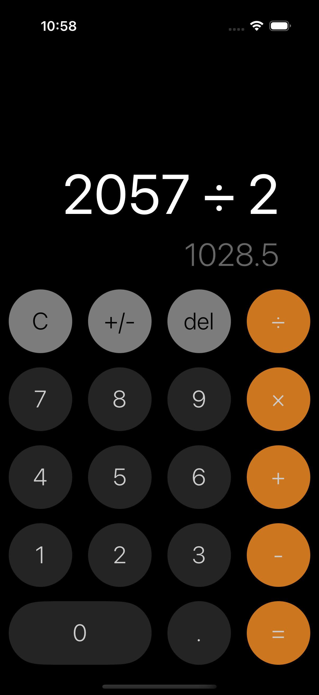
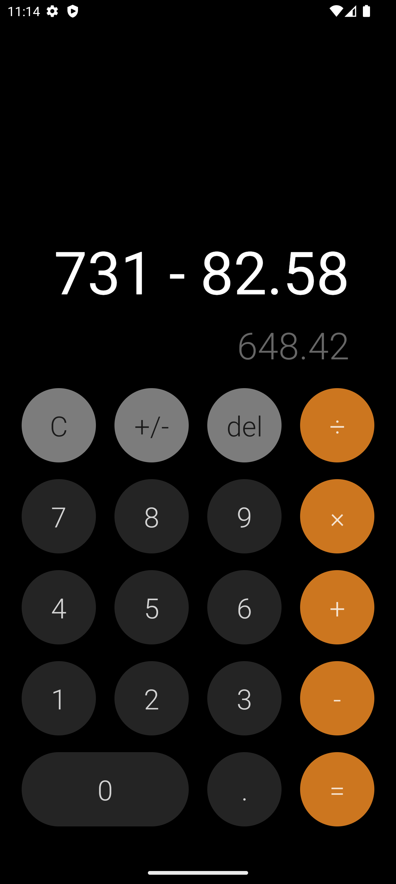
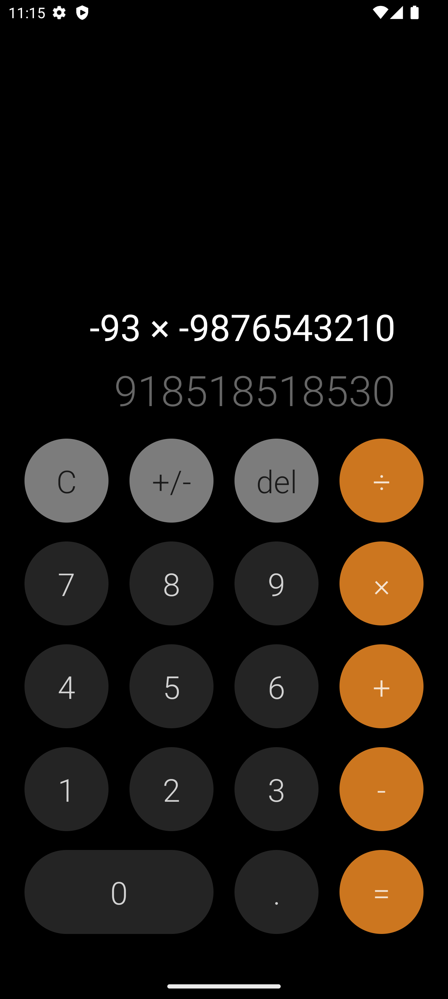

# Calculator App

📱 Project Description

A full-featured calculator app for both iOS and Android, built with React Native. The app has a clean and minimalistic design and mimics native performance for a calculator on both platforms. Its efficient, cross-platform implementation guarantees it will run smoothly and look exactly as expected on different devices.

🚀 Key Features:

• Basic arithmetic operations (addition, subtraction, multiplication, division)
• Responsive design to fit multiple screen sizes
• Cross platform native behavior optimized for iOS and Android

## Screenshots

<div style="display: flex; flex-direction: column; gap: 10px;">
    <div style="display: flex; justify-content: center; gap: 10px;">
        
        
    </div>
    <div style="display: flex; justify-content: center; gap: 10px;">
        
        
    </div>
</div>

## Step 1: Start the Metro Server

First, you will need to start **Metro**, the JavaScript _bundler_ that ships _with_ React Native.

To start Metro, run the following command from the _root_ of your React Native project:

```bash
# using npm
npm start

# OR using Yarn
yarn start
```

## Step 2: Start your Application

Let Metro Bundler run in its _own_ terminal. Open a _new_ terminal from the _root_ of your React Native project. Run the following command to start your _Android_ or _iOS_ app:

### For Android

```bash
# using npm
npm run android

# OR using Yarn
yarn android
```

### For iOS

```bash
# using npm
npm run ios

# OR using Yarn
yarn ios
```

If everything is set up _correctly_, you should see your new app running in your _Android Emulator_ or _iOS Simulator_ shortly provided you have set up your emulator/simulator correctly.

This is one way to run your app — you can also run it directly from within Android Studio and Xcode respectively.

## Step 3: Modifying your App

Now that you have successfully run the app, let's modify it.

1. Open `App.tsx` in your text editor of choice and edit some lines.
2. For **Android**: Press the <kbd>R</kbd> key twice or select **"Reload"** from the **Developer Menu** (<kbd>Ctrl</kbd> + <kbd>M</kbd> (on Window and Linux) or <kbd>Cmd ⌘</kbd> + <kbd>M</kbd> (on macOS)) to see your changes!

   For **iOS**: Hit <kbd>Cmd ⌘</kbd> + <kbd>R</kbd> in your iOS Simulator to reload the app and see your changes!

## Congratulations! 🥳

You've successfully run and modified your React Native App.
